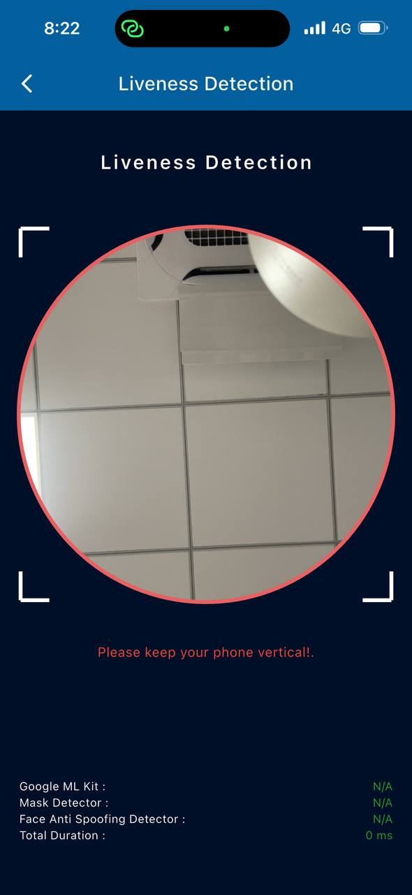
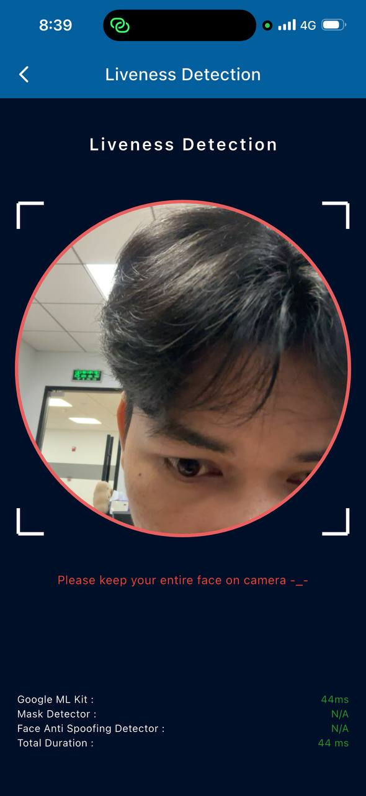
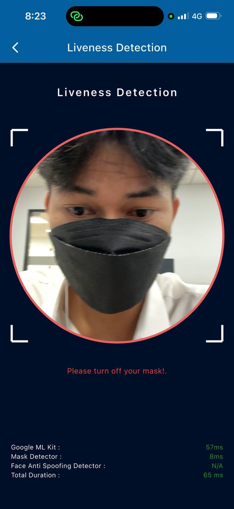
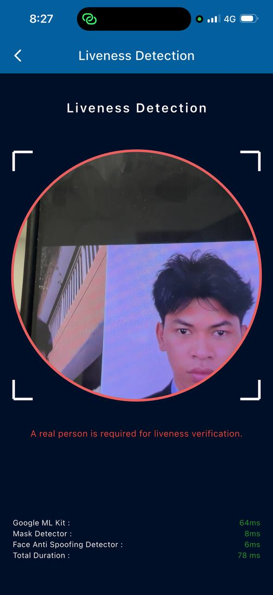

<!DOCTYPE html>
<html lang="en" style="font-family: Inter, sans-serif">
<head>
    <meta charset="UTF-8">
    <meta name="viewport" content="width=device-width, initial-scale=1.0">
    <title>Liveness App POC</title>
    <link rel="preconnect" href="https://fonts.googleapis.com">
    <link rel="preconnect" href="https://fonts.gstatic.com" crossorigin>
    <link href="https://fonts.googleapis.com/css2?family=Inter:ital,opsz,wght@0,14..32,100..900;1,14..32,100..900&display=swap" rel="stylesheet">
</head>
<body>
    <h1 id="face-liveness-detection">Face Liveness Detection</h1>
    
Face Liveness Detection is a biometric security technique that determines whether a face presented to a camera is from a real,   live person physically present at the time of capture rather than a spoof attempt using a photo, video, mask, or other artificial representation. 
          Face Liveness Detection sepearate into two categories :

    
<em><strong>Active Methods (require user interaction)</strong></em>

    <ul>
    <li>Blinking on command</li>
    <li>Turning head left/right</li>
    <li>Smiling or opening mouth</li>
    <li>Following a moving object with eyes</li>
    </ul>
    
<em><strong>Passive Methods (no user action needed)</strong></em>

    <ul>
    <li>Analyzing skin texture and micro-movements</li>
    <li>Detecting natural eye movement and micro-expressions</li>
    <li>3D depth sensing (e.g., structured light or IR)</li>
    <li>Blood flow detection via subtle color changes (rPPG)</li>
    </ul>
    

    <h2 id="core-components">Core Components</h2>
    <h3 id="1-google-ml-kit-face-detection">1. <strong>Google ML Kit Face Detection</strong></h3>
    <ul>
    <li><strong>Definition:</strong> Is an official ML model for face detection that develop by Google for solve real-world problem.</li>
    <li><strong>Platform Support</strong> : iOS &amp; Android</li>
    <li><strong>Requirements</strong> :
    <ul>
    <li><strong>iOS Platform</strong>
    <ul>
    <li>Minimum iOS Deployment Target: 15.5</li>
    <li>XCode 15.3.0 or newer</li>
    <li>Swift 5</li>
    <li>Support only 64-bit device</li>
    </ul>
    </li>
    <li><strong>Android Platform</strong>
    <ul>
    <li>minSdkVersion: 21(Android 5.0 + )</li>
    <li>targetSdkVersion: 35</li>
    <li>compileSdkVersion: 35</li>
    </ul>
    </li>
    </ul>
    </li>
    <li><strong>License</strong> : Free for usage</li>
    <li><strong>Resource:</strong> <a href="https://developers.google.com/ml-kit/vision/face-detection">https://developers.google.com/ml-kit/vision/face-detection</a></li>
    </ul>
    <h3 id="2-mask-detection">2. <strong>Mask Detection</strong></h3>
    <ul>
    <li><strong>Definition:</strong> ML model trained by <strong>Chandrikadeb7</strong> for detect mask</li>
    <li><strong>Platform Support</strong> : iOS &amp; Android</li>
    <li><strong>License</strong> : Open Source</li>
    <li><strong>Resource:</strong> <a href="https://github.com/chandrikadeb7/Face-Mask-Detection">https://github.com/chandrikadeb7/Face-Mask-Detection</a></li>
    </ul>
    <h3 id="3-face-anti-spoofing-silent-face-anti-spoofing">3. <strong>Face Anti-Spoofing (Silent-Face-Anti-Spoofing)</strong></h3>
    <ul>
    <li><strong>Definition:</strong> Deep learning model trained by <strong>Minivision-ai</strong> to detect between a real face and a spoof (such as a photo, video replay).</li>
    <li><strong>Platform Support</strong> : iOS &amp; Android</li>
    <li><strong>License</strong> : Open Source</li>
    <li><strong>Resource:</strong> <a href="https://github.com/minivision-ai/Silent-Face-Anti-Spoofing">https://github.com/minivision-ai/Silent-Face-Anti-Spoofing</a></li>
    </ul>
    <h3 id="4-device-sensors-sensor_plus">4. <strong>Device Sensors (sensor_plus)</strong></h3>
    <ul>
    <li><strong>Definition:</strong> Plugin for detetect device's aspect ratio and device's motion whether is verticle or not</li>
    <li><strong>Platform Support</strong> : iOS &amp; Android</li>
    <li><strong>Resource:</strong> <a href="https://pub.dev/packages/sensors_plus">https://pub.dev/packages/sensors_plus</a></li>
    </ul>
    

    <h2 id="overall-flow">Overall Flow</h2>
    <ol>
      <li>Open Device's Camera</li>
      <li>Check Device Position</li>
      <li>Detect Face From Camera Frame(Google ML Kit)</li>
      <li>Validation Face</li>
      <li>Check Mask(Mask Detector Model)</li>
      <li>Check Liveness(Anti Spoofing Model)</li>
      <li>Challenge Verification</li>
    </ol>
    
<em>Steps 4-7 processing background capture face for KYC</em>

     
    

      
      
      
      
   

   <h2 id="conclusion">Conclusion</h2>
    
<em>Should this exploration be applied to our project?</em>

    <h3 id="pros">Pros</h3>
    <ul>
    <li>Free to use — no licensing cost</li>
    <li>Fully customizable UI and liveness challenge flow</li>
    <li>Built-in Anti-Spoofing check for stronger security</li>
    <li>Flexible face capture logic tailored for KYC requirements</li>
    </ul>
    <h3 id="cons">Cons</h3>
    <ul>
    <li>Complex implementation — requires combining 3 models</li>
    <li>Higher processing time may impact performance on older devices</li>
    <li>Increased app size:
    <ul>
    <li>Android: 15MB → 20MB</li>
    <li>iOS: 10MB → 15MB</li>
    </ul>
    </li>
    </ul>
    
   
</body>
</html>
